  

  

## 🧠 My Focus Areas
- Full Stack Development (Web & App)
- ML
- Open Source Collaborations

## 📊 GitHub Stats & Trophies

  
  

  

  

## 🛠️ Languages & Tools

> ## Programming Languages

      

> ## Frontend

     

> ## Backend

  

> ## Database

  

> ## DevOps & Cloud

 

> ## Tools

    

  

## 🔗 Connect with Me

    

<picture>
  <source media="(prefers-color-scheme: dark)" srcset="https://raw.githubusercontent.com/cyprieng/github-breakout/main/example/dark.svg" />
  <source media="(prefers-color-scheme: light)" srcset="https://raw.githubusercontent.com/cyprieng/github-breakout/main/example/light.svg" />
  
</picture>

  

